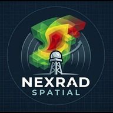

# Nexrad Spatial

Nexrad Spatial is an immersive, fully 3D volumetric weather radar and data visualization application built on top of Unreal Engine 5.7. It allows you to step inside extreme weather events, view raw radar sweeps from across the globe in breathtaking 3D detail, and analyze live atmospheric data dynamically in Virtual Reality.

For more information, visit our website at [NexradSpatial.com](https://NexradSpatial.com) or join the community on the [Nexrad Spatial Discord Server](https://discord.gg/nexradspatial).

## Open Source Credits

This project is a heavily expanded derivative work of the open-source **OpenStorm Radar** project (originally developed by Jordan Schlick). In accordance with the GPLv2 license, the core radar ingestion, binary decoding, and processing architecture utilized within this application are fully open-source.

* **OpenStorm Base Framework:** Copyright (c) Jordan Schlick & Contributors.
* **Nexrad Spatial Modifications:** Copyright (c) 2026 Nexrad Spatial.

*If you are interested in the original desktop application without the VR ecosystem modifications, check out the original [OpenStorm repository on GitHub](https://github.com/Kitt-p/OpenStorm).*